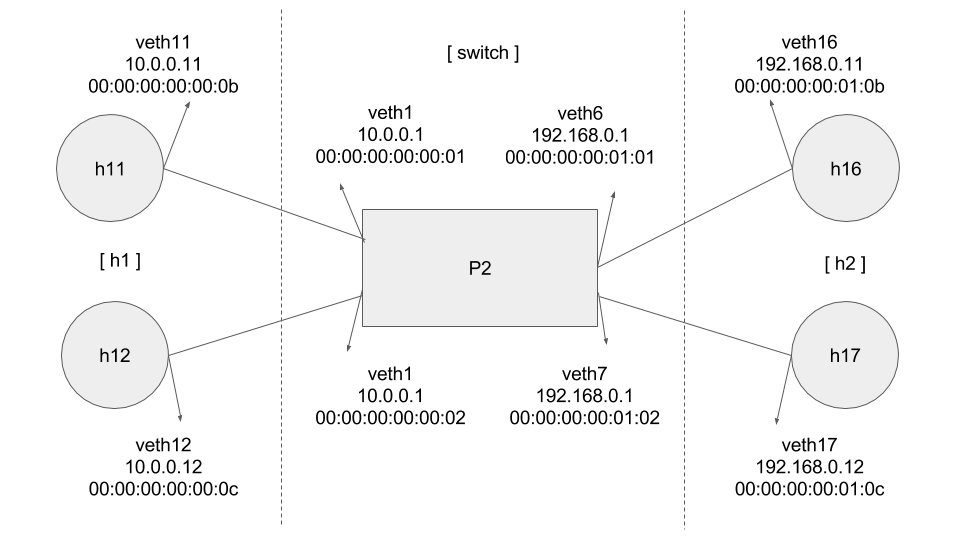

### Introduction to C2

A simple_nat program on https://github.com/p4lang/tutorials/tree/master/examples/simple_nat .

Network topology is shown in the following picture:



Network address transfer:

* 10.0.0.11:port <==> 192.168.0.2:port (port >= 9000)

* 10.0.0.12:port <==> 192.168.0.2:port (port < 9000)

### Setup method

#### 0. rename your physical NICs according to the topology

#### 1. set up virtual network topology
```
bash setup_h1.sh
bash setup_h2.sh
bash setup_switch.sh
```

#### 2. compile p4 source program in origin/cache
```
bash compile.sh [origin/cache]
```

#### 3. launch switch with bmv2 model in origin/cache
```
bash start.sh [origin/cache]
```

#### 4. populate entry to table origin/cache
```
bash populate.sh [origin/cache]
```

PS: You could add different cache entries in cache/commands_backup to cache/commands, in order to setup a cache hit or cache miss case.

### Test method

#### get latency

On host 1, run

```
ip netns exec h11 tcpping -x 10000 -r 0.003 192.168.0.11 80
```

#### get throughput

On host 2, run

```
ip netns exec h16 iperf -s -p 80
```

On host 1, run
```
ip netns exec h11 iperf -c 192.168.0.11 -p 80 -i 10 -t 100
```
